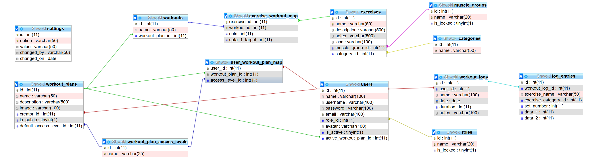

# Table of Contents
1. [Installation Instructions](#how-to-deploy)
2. [Database Architecture](#database-overview)

# How to deploy

## MySQL / MariaDB
This tutorial assumes you're working on a Debian based system.

### Step 1. Install the database
For this step, there are 2 alternatives that are supported and tested so far, and those are:
1. MariaDB
``` bash
sudo apt install mariadb-server -y;

sudo service mariadb enable;
sudo service mariadb start;
```
2. MySQL
``` bash
sudo apt install mysql-server -y;

sudo service mysql enable;
sudo service mysql start;
```

Optionally, for a visual database management solution, you could also install PhpMyAdmin.
``` bash
sudo apt install phpmyadmin;
```

### Step 2. Secure your SQL install
Run the following command, set a root password, and remove all anonymous users and test database by following the prompts:
``` bash
sudo mysql_secure_installation
```
``` bash
# Sample output:
Please set the password for root here.

New password:

Re-enter new password:

By default, a MySQL installation has an anonymous user,
allowing anyone to log into MySQL without having to have
a user account created for them. This is intended only for
testing, and to make the installation go a bit smoother.
You should remove them before moving into a production
environment.

Remove anonymous users? (Press y|Y for Yes, any other key for No) : y
Success.


Normally, root should only be allowed to connect from
'localhost'. This ensures that someone cannot guess at
the root password from the network.

Disallow root login remotely? (Press y|Y for Yes, any other key for No) : y
Success.

By default, MySQL comes with a database named 'test' that
anyone can access. This is also intended only for testing,
and should be removed before moving into a production
environment.


Remove test database and access to it? (Press y|Y for Yes, any other key for No) : y
 - Dropping test database...
Success.

 - Removing privileges on test database...
Success.

Reloading the privilege tables will ensure that all changes
made so far will take effect immediately.

Reload privilege tables now? (Press y|Y for Yes, any other key for No) : y
Success.

All done!
```


### Step 3. Configure your mysql instance
Enter the mysql command line via `sudo mysql -u root -p` and provide the password you entered at [step 2](#step-2-secure-your-sql-install). From here, there are a few things we need to set up:
1. Create the shwokl user
   There are 2 options in this section. If you deploy the api server on the same machine, and the access is local, then create the user like so:
    ``` sql
    CREATE USER `shwokl_api`@`localhost` IDENTIFIED BY `your_secure_password here`;
    ```
    If the api server lives on another machine, then make the following adjustments:
    ``` sql
    CREATE USER `shwokl_api`@`%` IDENTIFIED BY `your_secure_password here`;
    ```
    Also, you can create both users if you are not sure which path you'll take and remove after the fact.
2. Create the shwokl database
   ``` sql
   CREATE DATABASE Shwokl;
   ```
3. Grant all permissions to our new user
   ``` sql
   GRANT ALL ON Shwokl.* to 'shwokl_api'@'localhost' WITH GRANT OPTION;
   ```
   Make sure to replace `localhost` with `%` to match your option for step 3.1
4. Flush the privileges
   ``` sql
   FLUSH PRIVILEGES;
   ```

### Step 4. Dump the db_init.sql file into your newly created database
Get the `./mysql/db_init.sql` script on your machine, navigate to the directory it was downloaded in and run the following command:
``` sql
sudo mysql -u root -p Shwokl < ./db_init.sql
```
And provide the root password you set at step 2. 

At this point, congratulations, we're all done.


# Database Overview



Tables:
- [roles](#roles)
- [categories](#categories)
- [muscle_groups](#muscle-groups)
- [exercises](#exercises)
- [users](#users)
- [workouts](#workouts)
- [workout_plan_access_levels](#workout-plan-access-levels)
- [workout_plans](#workout-plans)
- [workouts_logs](#workout-logs)
- [log_entries](#log-entries)
- [settings](#settings)
- [user_workoutplan_map](#user-workoutplan-map)
- [exercise_workout_map](#exercise-workout-map)

## Roles
| id                   | name    | is_locked |
| :------------------: | :-----: | :-------: |
| INTEGER, PRIMARY KEY | VARCHAR | BOOLEAN   |

### Description
This table stores all the possible roles a user can have. These roles are used to set permissions across users for different actions.

### Limitations
If the `is_locked` field is set to `true`, it means that that role can not be deleted and is a default one. Only the basic roles come with `is_locked = true`. Any other roles added by any administrator are by default deletable/editable by any other administrator.

Only administrators can create new roles and assign users.

### Relationships
A user can only have one role assigned, so the relationship between users and roles is N:1.  
This relationship is implemented via the foreign key [`users`](#users)(`role_id`)

### Predefined values
The basic roles are:
- Administrator
- User
- Guest

#### Administrator
The admin role gives any user full access to change and tweak any setting, to delete or modify any entry, without any restrictions. **Use with caution**, as some actions can break the app.

#### User
The user role is meant for...well... general users, giving limited access in terms of settings, and delete/modify permission only for fields they themselves created.

#### Guest
The guest role provides no access to any settings, and read-only access to any public fields.

### Data Restrictions
1. `name` can NOT be `null`
2. `name` must be `UNIQUE`
3. `is_locked` can NOT be `null`
4. `is_locked` is `false` for any role created by any administrator

## Categories
| id                   | name    |
| :------------------: | :-----: |
| INTEGER, PRIMARY KEY | VARCHAR |

### Description
This table holds all the categories one exercise can be associated with. 

The categories tell the app what kind of information needs to be tracked for any given exercise in the [`log_entries`](#log-entries) table. Basically, based on what category an exercise is linked to, the fields `data_1` and `data_2` gain meaning.

### Limitations
This table is not editable, and further categories cannot be added via the app, only via app updates.

### Relationships
An exercise can only have a single category associated with it, and as such, the relationship between exercises and categories is N:1  
This relationship is implemented via the foreign key [`exercises`](#exercises)(`category_id`)

### Predefined values
The predefined categories are:
- Weight and Repetitions
  - `data_1` -> weight
  - `data_2` -> repetitions
- Repetitions
  - `data_1` -> repetitions
  - `data_2` -> null
- Distance and Time
  - `data_1` -> distance
  - `data_2` -> time
- Time
  - `data_1` -> time
  - `data_2` -> null
  
### Data Restrictions
1. `name` can NOT be `null`
2. `name` must be `UNIQUE`

## Muscle Groups
| id                   | name    | is_locked |
| :------------------: | :-----: | :-------: |
| INTEGER, PRIMARY KEY | VARCHAR | BOOLEAN   |

### Description
This table stores all the main muscle groups that can be targeted by an exercise.

### Limitations
The default muscle groups cannot be deleted and are marked by the `is_locked` field being set to `true`.
Any other muscle group added by users will be deletable and editable and marked by `is_locked` being `false`;

Only administrators can create new muscle groups.

### Relationships
An exercise can only target one muscle group, but the same muscle group can be targeted by multiple exercises. As such, the relationship between exercises and muscle_groups is N:1.  

This relationship is implemented via the foreign key [`exercises`](#exercises)(`muscle_group_id`)

### Predefined values
The default muscle groups are:
- Quadriceps
- Hamstrings
- Calves
- Chest
- Back
- Shoulders
- Biceps
- Triceps
- Forearms
- Trapezius
- Abs
- Cardio

### Data restrictions
1. `name` can NOT be `null`
2. `name` must be `UNIQUE`
3. `is_locked` can NOT be `null`
4. `is_locked` is `false` for any muscle group created by any administrator

## Exercises
| id                   | name    | description | notes   | icon | muscle_group_id | category_id |
| :------------------: | :-----: | :---------: | :-----: | :--: | :-------------: | :---------: |
| INTEGER, PRIMARY KEY | VARCHAR | VARCHAR     | VARCHAR | VARCHAR | FOREIGN KEY     | FOREIGN KEY |

### Description
This table stores all the exercises that are available.

### Limitations
Exercises are NOT personal, and all users can view all exercises regardless of who created them.
All exercises must be unique (in terms of name).

### Relationships
#### Foreign Keys
The foreign keys present in this table represent 1:N relationships and are:
- `muscle_group_id` -> [`muscle_groups`](#muscle-groups)(`id`)
- `category_id` -> [`categories`](#categories)(`id`)
  
#### Data Integrity
Since categories can't be altered, there is no need to worry about data integrity in case of deletion, as it can not happen. 

> The default category for an exercise is `Weight and Repetitions`. From within the settings, this can be configured to default to other values, such as setting the category to `Distance and Time` upon creation.

As for muscle groups, any deletion will cause an invalid reference for the foreign key. By default, if a muscle group is deleted, the reference gets set to `null`, and the api server is responsible to assign it the value `1`, basically assigning it the `None` group.

### Data Restrictions
1. `name` can NOT be `null`
2. `name` must be `UNIQUE`
3. `category_id` can NOT be `null`

> ***NOTE***  
> The field `muscle_group_id` CAN be `null`, but it never SHOULD be. See [above](#data-integrity) for an overview of how data integrity is preserved in the case of a muscle group deletion


## Users
| id                   | name    | username | password | email   | role_id | avatar | is_active | active_workout_plan_id |
| :------------------: | :-----: | :------: | :------: | :-----: | :-----: | :----: | :-------: | :--------------------: |
| INTEGER, PRIMARY KEY | VARCHAR | VARCHAR  | VARCHAR  | VARCHAR | INTEGER | VARCHAR   | BOOL      | INTEGER                |

### Description
This table keeps track of all the users registered to the app. 

The functionality of `is_active` is intended to allow users that no longer use the app to be archived in case they may return or to use their data for statistics.

Users can log in either via `username` and `password` or via `email` and `password`.

Since usernames are NOT `UNIQUE`, the actual username displayed within the app follows this pattern: 'username#id'. For example, the main user is 'admin', and the displayed username is 'admin#1'.

### Limitations
Users can be modified either by themselves, or by an administrator.

### Relationships
#### Foreign Keys
The foreign keys present in this table represent 1:N relationships and are:
- `role_id` -> ['roles'](#roles)(`id`)
- `active_workout_plan_id` -> [`workout_plans`](#workout-plans)(`id`)
  
#### Data Integrity
Since roles can be added and deleted, the integrity of the `role_id` field can be compromised. By default, if a role is deleted, the reference gets set to `null`, and the api server is responsible to assign it the value `2`, basically assigning it the `User` role.

> The default role for new users and for users with deleted roles is `User`. From within the settings, this can be configured to default to other values, such as assigning the `Guest` role by default for increased security.

Workout plans can be deleted too, and that dependency is handled by setting the reference to `null`. This basically means that the user has no active workout plan at the moment. 

> Note that this field can contain null values, as it is not mandatory for a user to have an active plan at all times

### Data Restrictions
1. `username` can NOT be `null`
2. `password` can NOT be `null`
3. `email` can NOT be `null`
4. `email` must be `UNIQUE`
5. `role_id` is `2` by default 
   - this is handled via the API server, not at the SQL level
   - this is a 'virtual' restriction
6. `is_active` is `true` by default

## Workouts
| id                   | name    | workout_plan_id      |
| :------------------: | :-----: | :------------------: |
| INTEGER, PRIMARY KEY | VARCHAR | INTEGER, FOREIGN KEY |

### Description
This table keeps track of all existing workouts. No information is stored as to what exercises it contains or the sets or anything else. It only keeps track of their existence. Those pieces of information are stored in [link tables](#link-tables).

### Limitations
A workout can only be edited or deleted by the user that created the workout plan. This user is identified by the [`workout_plans`](#workout-plans)(`creator_id`), or by any user with an `access_level` higher than `workout_viewer`.

### Relationships
A workout can only be assigned to a single workout plan, but a plan may contain multiple workouts.
#### Foreign Keys
The foreign keys present in this table represent 1:N relationships and are:
- `workout_plan_id` -> [`workout_plans`](#workout-plans)(`id`)

#### Data Integrity
Since workout plans can be deleted, and since workouts are not standalone entities, they are only children of plans, then, naturally, any workout is deleted when the parent plan is deleted.

### Data Restrictions
1. `name` can NOT be `null`
2. `workout_plan_id` can NOT be `null`

## Workout Plan Access Levels
| id                   | name    |
| :------------------: | :-----: |
| INTEGER, PRIMARY KEY | VARCHAR |

### Description
This table stores all the possible access levels a user can be granted for a particular [workout plan](#workout-plans). These levels are used to set permissions across users for different actions.

### Limitations
This table is not editable. More access levels can not be added by any user.

### Predefined values
The basic roles are:
- Plan Manager
- Plan Member
- Plan Viewer

#### Plan Manager
This access level gives any user full access to change and tweak any field, to delete or modify any entry, without any restrictions, as if they were the creator of the workout plan.

#### Plan Member
This access level provides no means for the user to change any fields of the workout plan, to add or remove workouts and or exercises. This access level only allows the user to set the workout plan as being active and run it. No edit functionality whatsoever is given to these users.

#### Plan Viewer
This access level only allows the user to view the plan and that's it. They can not edit, they can now assign it as active or run it.

### Data Restrictions
1. `name` can NOT be `null`
2. `name` must be `UNIQUE`

## Workout Plans
| id                   | name    | description | image | creator_id | is_public | default_access_level_id |
| :------------------: | :-----: | :---------: | :---: | :--------: | :-------: | :---------------------: |
| INTEGER, PRIMARY KEY | VARCHAR | VARCHAR     | VARCHAR  | INTEGER    | BOOL      | INTEGER                 |

### Description
This table keeps track of all the workout plans known to the app, regardless of the user who created them or who has access to what, and some basic sharing-related fields.

### Limitations
The fields of any workout plan can only be modified by:
  - The creator
  - The administrators
  - Any user with an `access_level_id` of `2` or higher (see [above](#workout-plan-access-levels) for details)

### Relationships
A workout plan can only have a single creator.
A workout plan can be viewed by multiple users based on a few criteria:
1. If the workout is marked as public (`is_public == true`) then all users have the `default_access_level_id` to its contents
2. If the workout is marked as private (`is_public == false`) then the only users that have access to it are:
   1. the creator
   2. any user that has been granted access by either the creator or an administrator
   3. any administrator
#### Foreign Keys
The foreign keys present in this table represent 1:N relationships and are:
- `creator_id` -> [`users`](#users)(`id`)
- `default_access_level_id` -> [`workout_access_levels`](#workout-plan-access-levels)(`id`)
#### Data Integrity
Since users can be created and deleted at any time, the integrity of the `creator_id` foreign key is handled by simply deleting ALL workouts plans that the user created, and as such, all other users that had access to said workout plan will lose said access.

Access levels can not be tampered with, so the integrity of that foreign key is not put at risk.

### Data Restrictions
1. `name` can NOT be `null`
2. `creator_id` can NOT be `null`
3. `is_public` can NOT be `null`
4. `is_public` is `false` by default
5. `default_access_level_id` can NOT be `null`
6. `default_access_level_id` is `3` by default

## Workout Logs
| id                   | user_id | name    | date | duration | notes   |
| :------------------: | :-----: | :-----: | :--: | :------: | :-----: |
| INTEGER, PRIMARY KEY | INTEGER | VARCHAR | DATE | INTEGER  | VARCHAR |

### Description
This table holds all logs the users made as a whole. By that it means that this table keeps track of who ran what workout and when. It doesn't hold details about the ran workout other than the fact that it exists.

### Limitations
This table is only editable by the user referenced by `user_id` or administrators and shouldn't really be messed with unless mistakes were made when logging.

### Relationships
A workout log can only be linked to a single user.
#### Foreign Keys
The foreign keys present in this table represent 1:N relationships and are:
- `user_id` -> [`users`](#users)(`id`)
#### Data Integrity
Since users can be created and deleted at any time, and keeping logs for non existing user makes no sense, all logs are deleted if a user is deleted. If this is undesired behaviour, look into **archiving users** instead of **deleting users**.

### Data Restrictions
1. `user_id` can NOT be `null`
2. `name` can NOT be `null`
3. `date` can NOT be `null`
4. `duration` can NOT be `null`

## Log Entries

| id                   | workout_log_id | exercise_name | exercise_category_id | set_number | data_1  | data_2  |
| :------------------: | :------------: | :-----------: | :------------------: | :--------: | :-----: | :-----: |
| INTEGER, PRIMARY KEY | INTEGER        | VARCHAR       | INTEGER              | INTEGER    | INTEGER | INTEGER |

### Description
This table expands on [`workout_logs`](#workout-logs) and keeps track of what exercises were performed during what workout log and all the related information.

### Limitations
This table is only editable by the user referenced by [`workout_logs`](#workout-logs)(`user_id`) or administrators and shouldn't really be messed with unless mistakes were made when logging.

### Relationships
A log entry can only be linked to a single workout log.
#### Foreign Keys
The foreign keys present in this table represent 1:N relationships and are:
- `workout_log_id` -> [`workout_logs`](#workout-logs)(`id`)
- `exercise_category_id` -> [`categories`](#categories)(`id`)
#### Data Integrity
Since logs can be deleted (along with the parent user), log entries will be deleted one such a thing happens, as it makes no sense to keep them if their parent is gone.

Exercise categories can not be messed with, so the integrity of that key is not at risk.

> ***NOTE***  
> We are storing the `exercise_name` and not the `exercise_id` as exercises can be added and removed, and in order to more easily handle integrity maintenance, keeping track of names is simpler.

### Data Restrictions
1. `workout_log_id` can NOT be `null`
2. `exercise_name` can NOT be `null`
3. `exercise_category_id` can NOT be `null`
4. `set_number` can NOT be `null`
5. `data_1` can NOT be `null`

## Settings
| id                   | option  | value   | changed_by | changed_on |
| :------------------: | :-----: | :-----: | :--------: | :--------: |
| INTEGER, PRIMARY KEY | VARCHAR | VARCHAR | VARCHAR    | DATE       |

### Description
This table stores internal settings values and keeps track of who changed them last.

The field `option` marks the name of the setting item, and `value` is the actual value of said item. The `changed_by` field will store the `name` of the user that made the change, and not the `id`, while `changed_on` will simply store the date and time at which the change was made.

### Limitations
Only administrators have access to internal app settings.

### Relationships
No relationship is implemented to avoid data integrity issues. As such, the `changed_by` field will hold the username of the user who changed the setting option instead of storing the id, to avoid the hassle of user deletion.

### Data Restrictions
1. `option` can NOT be `null`
2. `option` must be `UNIQUE`
3. `value` can NOT be `null`
4. `changed_by` can NOT be `null`
5. `changed_on` can NOT be `null`
   
## Link Tables

### User-WorkoutPlan-Map
| id                   | user_id | workout_plan_id | access_level_id |
| :------------------: | :-----: | :-------------: | :-------------: |
| INTEGER, PRIMARY KEY | INTEGER | INTEGER         | INTEGER         |

#### Description
This table keeps track of who can access what workout plan and how much can they edit it, if at all.

#### Limitations
There is no direct access to this table. Only workout plan creators or administrators can grant access to their plan to other users and can decide how much control they give.

#### Relationships
There are 2 relationships implemented via this table, one of them being N:N (multiple users can access multiple workout plans) and the other being 1:N (one user-workoutplan-map can only have one access_level)
##### Foreign Keys
The foreign keys for the N:N relationship are:
- `user_id` -> [`users`](#users)(`id`)
- `workout_plan_id` -> [`workouts_plans`](#workout-plans)(`id`)

The foreign key for the 1:N relationship is:
- `access_level_id` -> [`workout_access_levels`](#workout-plan-access-levels)(`id`)
##### Data Integrity
Since both users and workout plans can be deleted and added at any time, if any of the 2 references get deleted, then the entry is deleted too. No point in keeping track of relationships for non existing entities.

As for access levels, they are not editable, so we don't have to worry about those.

#### Data Restrictions
1. `user_id` can NOT be `null`
2. `workout_plan_id` can NOT be `null`
3. `access_level_id` can NOT be `null`


### Exercise-Workout-Map
| id                   | exercise_id | workout_id | sets    | data_1_target |
| :------------------: | :---------: | :--------: | :-----: | :-----------: |
| INTEGER, PRIMARY KEY | INTEGER     | INTEGER    | INTEGER | INTEGER       |

#### Description
This table keeps track of what exercises are in what workouts, for how many sets they are intended to be performed and if there is a target for [`log_entries`](#log-entries)(`data_1`).

#### Limitations
This table can only be edited by the workout plan creator or by administrators.

#### Relationships
This table implements the N:N relationship between exercises and workouts.
##### Foreign Keys
The foreign keys present in this table are:
- `exercise_id` -> [`exercises`](#exercise-workout-map)(`id`)
- `workout_id` -> [`workouts`](#workouts)(`id`)
##### Data Integrity
Since both exercises and workouts can be added and deleted at any time, if any of the 2 references gets deleted, then the entry itself is removed too.

#### Data Restrictions
1. `exercise_id` can NOT be `null`
2. `workout_id` can NOT be `null`